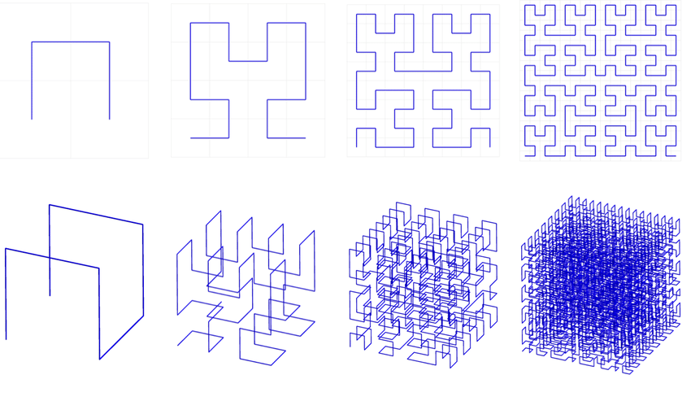

# Hilbert Curve Transform

The **Hilbert** crate implements the highly efficient Skilling algorithm for performing the Hilbert curve transformation and its inverse for points in two dimensions on up to points with thousands of dimensions in **Rust**. The original algorithm in C may be found in this conference article:

"Programming the Hilbert curve" by **John Skilling**. AIP Conference Proceedings 707, 381 (2004); https://doi.org/10.1063/1.1751381

## Uses for the Hilbert Curve

Researchers have discovered many uses for the Hilbert Curve, including:

  - Speeding up K-Nearest neighbor search
  - Unassisted, high-dimensional clustering
  - Data compression
  - Pseudo-random number generation
  - Processing Lidar point clouds
  - Database query optimization
  - Approximate traveling salesman solutions




## Performance

 Skilling's algorithm can perform the transformation in time linearly proportional to D (the number of dimensions) and B (the number of bits required to encode each coordinate.) This performance is greatly superior to most if not all other algorithms in the literature when dealing with high dimensional points (anything over a half dozen dimensions).

## Features

This library offers the following features:

  - _Forward Hilbert Curve transformation_ from a D-dimensional point to a 1-dimensional index (represented as a `BigUint`). See the `fast_hilbert` module.
  - _Inverse Hilbert Curve transformation_ from a 1-dimensional `BigUint` index back to a D-dimensional point. See the `fast_hilbert` module.
  - _D-dimensional points_ whose Euclidean distance formula has been optimized, making it suitable for use in **K-nearest neighbor** searches. See the `Point` class. The `hilbert_sort` method sorts points according to the Hilbert Curve.
  - _Data normalization_ routines to prepare input data so that a Hilbert transform may be applied to it. See the classes `IntegerDataRange` and `FloatDataRange`. The `normalize` and `compress` methods can translate and scale the input data and coerce it into the unsigned values that the Hilbert transform requires.
  - _Permutation_ logic, for generating alternate Hilbert curves for the same data. See the `Permutation` class.

## Benchmarks

To run the benchmarks:

```
> cargo bench
```

The benchmarks rely upon the criterion crate, which functions best if you install **gnu-plot**. If it is installed and findable on the path, it will write a report here:

`hilbert\target\criterion\report\index.html`

## Examples

Here are examples using the crate:

  1. Create two 3-D points and get the square of the distance between them.
  2. Perform the Hilbert Transform on a single point.
  3. Create several points and normalize them.
  4. Sort the points by the Hilbert Curve, using 11 bits per dimension.

```
        // 1. Create two 3-D points and get the square of the distance between them.
        let p1 = Point::new(0, &[3, 4, 5]);
        let p2 = Point::new(0, &[0, 8, 10]);
        let sqr_dist = p1.square_distance(&p2);
        assert(sqr_dist == 50, "Square distance should be 50");

        // 2. Perform the Hilbert Transform on a single point,
        //    using 5 bits per dimension (which assumes no coordinate exceeds 31).
        let index1 = p1.hilbert_transform(5);

        // 3. Create several points and normalize them.
        //    This will ensure that the ids begin at zero and that all values
        //    are multiplied by 10.0 before being rounded to the nearest integer,
        //    to preserve the predetermined precision.
        let point_data : Vec<Vec<f64>> = vec![
           vec![-10.5, 5.27, 3.66],
           vec![-4.802, 20.2, 100.19],
           vec![42.0, -100.0, 0.0]
        ];
        let mut points = point_list::make_points_f64(point_data, 0, None, None, 10.0);

        // 4. Sort the points by the Hilbert Curve, using 11 bits per dimension,
        //    because the range of data is 200.19, multiplied by the scale of 10 
        //  yields 2001.9, ceiling of that yields 2002, which is between 1024 (2^10) 
        //  and 2048 (2^11), so 11 bits are required to store the 
        //  highest coordinate value.
        hilbert_sort(&mut points, 11);
```

