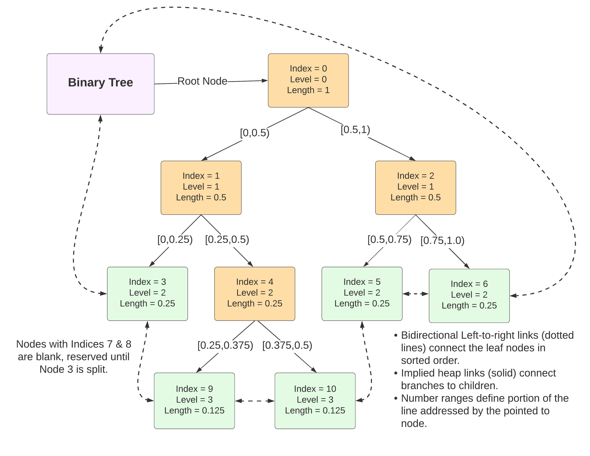
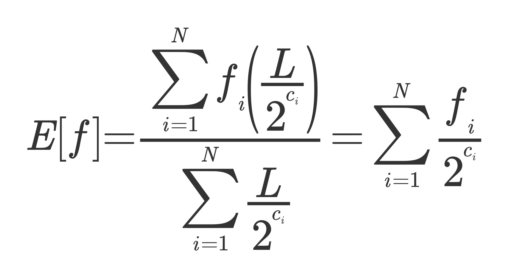
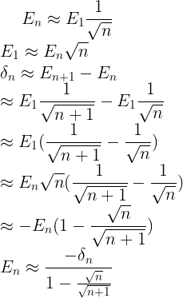
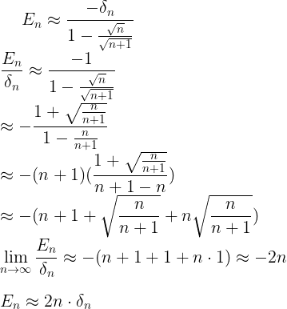
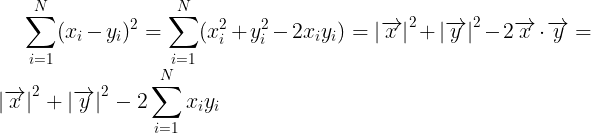
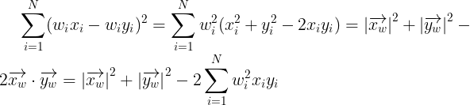

# Stratified Numerical Integration with the Hilbert Curve

This describes a stratified, pseudo-random sampling <a href="#algorithm">algorithm</a> for numerical integration 
in high-dimensions that employs the Hilbert curve to define volumes of space. 
It recursiuvely divides space into smaller volumes, each typified by a single sample 
and slope. The division of space prefers "interesting" regions with high sample or slope 
values in order to reduce the absolute relative error.

The efficient and accurate numerical integration of High dimensional functions is a 
hard problem. This describes an adaptive sampling algorithm built upon a 
fractal spatial index that should prove useful for some classes of functions. 
The approach may be distinguished from other algorithms by these attributes:

 - How new <a href="#sampling">samples</a> are chosen
 - How prior samples are <a href="#spatial_index">indexed</a> (if at all)
 - How the index is updated when <a href="#bisect_volume">dividing volumes</a>
 - How the binary tree used to speed searches is maintained <a href="#bisect_tree_node">during splits</a>
 - How results of prior samples influence the choice of new samples using a <a href="#strategy">balanced stratification strategy</a>
 - How a **randomized quasi-Monte Carlo** enhancement is implemented as <a href="#jitter">Jitter</a>
 - <a href="#memory">Memory usage</a> as a function of dimensionality
 - <a href="#stopping_criteria">Stopping criteria</a> test rate of convergence as a function of the number of samples taken 
 - Simplicity

The **Hilbert Curve** (a fractal, space-filling curve) may be employed when performing 
numerical integration in high dimensions. This curve permits the mapping of an 
N-dimensional space into a one dimensional space with good locality guarantees, 
thus allowing one to create a canonical ordering of points. Its purpose is to support 
the construction of a spacial index with a small memory footprint that is easily sliced 
into smaller pieces. The spatial index influences where in the space to draw the 
next sample from, directing the algorithm to sample more heavily in volumes 
where clues from prior samples indicate that the current estimate is likely to have 
the highest error. This in turn should speed up convergence of the algorithm.

## Integration Alternatives Compared

Some ways to integrate a volume iteratively divide the volume into smaller and smaller cubes or rectangular volumes and perform estimates on that volume, then sum up the estimates for all volumes investigated. This is analogous to Newton's method for integration in one dimension. The algorithms differ by how they sample the space and how they construct their spatial index (if they use one): 

 - **Gridded sampling** samples all points in a regular grid following a raster pattern, then averages the results. The number of samples required grows as `t^D` where `t` is the number of tick marks (divisions) along one axis and `D` is the number of dimensions. The number of points you need to sample grows exponentially with the number of dimensions and convergence is poor. If the granularity is not good enough, to double the number of ticks per dimension you must multiply samples by `2^D`, which is horrendous.
 - **Random sampling** (Monte-Carlo) has the benefit that it converges at the same rate, regardless of how many dimensions the problem has. The error decreases inversely proportional to the square root of N (the number of samples). No spatial index is needed. This is the simplest algorithm but has the poorest rate of convergence.
 - **Pseudo-random sampling** has the benefit of converging must faster than the truly random sampling of Monte-Carlo. It relies upon numerical sequences that possess low discrepancy (a measure of clumpiness). The best of these sequences, such as the **Sobol sequence**, require large code libraries of complex polynomials. A different polynomial is required for each number of dimensions. No spatial index is needed.
 - **Stratified sampling** has the benefit of reducing the RMS error, because regions of the space with higher values of the function being integrated are preferred to regions with smaller values. Thus they remove errors where their absolute values are likely to be highest in magnitude. This requires a spatial index to keep track of previous samples. Most such indices have memory use that grows exponentially with the number of dimensions.
 - **Adaptive Hilbert Sampling** uses segments of the Hilbert Curve to represent volumes in hyperspace for its spatial index. It builds on the benefits of pseudo-random and stratified sampling while using less memory in its spatial index. Dividing the spatial index into pieces is simpler. Deciding which piece should be split next is also simpler.

Note: Pseudo-random sampling does not deliver on the promise of faster convergence unless `N > 2^d` where `N` is the number of samples and `d` is the number of dimensions. For example, if the problem has 30 dimensions, N must exceed a billion.

## <a id="memory">Reducing Memory required for the Spacial Index</a>

Random or pseudo-random sampling can be done without memorizing previous samples, hence do not need to store a structure of the visited space in a grid or tree, such as r-trees or octocubes. Adaptive sampling (such as stratified or Hilbert) must keep such a structure to guide decisions on where to probe for the next sample.

If a grid or tree is constructed, high dimensions pose a problem, as the size of the memory needed to form the structure rises exponentially with the number of dimensions. After one to two-dozen dimensions, these approaches break down. The spatial index becomes unworkable. In addition, searching for existing points within the index becomes slower in high dimensions. For low dimensions it is proportional to O(log2(N)), but in higher dimensions most cells have zero or one point in them and so the speed of searching is closer to O(N).

That is where the Hilbert Curve comes in. Instead of representing a volume of space as an origin point and width for every dimension and a means of stitching each hypervolume to its adjacent volumes in a tree and a procedure for dissecting the volume along each axis (such as done with balanced binary trees), you get something that looks like a list of one-dimensional line segments. The volume definition for a single segment requires these attributes:

 - coordinates of start point (in the probem's floating point N-space)
 - Hilbert axes of start point (coordinates after being translated and scaled to positive integer N-space in range `[0,2^B)`, where `B` is the number of bits of precision per dimension)
 - included Hilbert start point (a Hilbert index as a Big Integer)
 - excluded Hilbert end point (a Hilbert index as a Big Integer)
 - length along the Hilbert curve (simplified as number of binary cuts performed on the full curve length, an integer)
 - sampled value of the integrand (a double)
 - weighted square distance in positive integer N-space between start and end Axes

Some of the properties above are derived implicitly from others, to reduce storage.
For example, the ending Hilbert index is stored as the start index for the next segment.

Note: The transform from Hilbert Axes to Hilbert Index is provided by this library, 
as is support for the translation and scaling of real valued points in problem space 
to positive integer Axes.

**Binary Heap**. The stitching of volumes to form the space could just be storing these segments in Hilbert Index order. However, to facilitate efficient random sampling of the segments according to a **discrete probability distribution**, a binary heap will be used which also maintains a doubly-linked list of leaf nodes in sorted order.

## <a id="spatial_index">Hilbert Spatial Index</a>

What is the Hilbert spatial index? It is a structure used to divide a volume 
into pieces so that the algorithm may integrate over the space by divide and conquer.

  - It is a doubly-linked List of line segments along the **Hilbert Curve**, a space-filling curve with useful properties discovered in the 19th century by Hilbert, a prominent mathematician.
  - On top of the doubly-linked list is a binary tree stored in a heap, to facilitate an efficient way to search for segments and perform pseudo-random sampling where each existing segment is chosen with a probaility in proportion to its length. (This is called **sampling from a discrete distribution**.)
  - Segments are sorted by increasing Hilbert Index `I` (a big integer).
  - The segment has a length `S` (another big integer) which is the difference between its start index `I` and that of the next volume in the list.
  - The segment has an `N`-dimensional Point, the coordinate in `N`-space prior to the Hilbert curve transformation being applied. (It is stored in two forms: problem space, where coordinates have arbitrary ranges, may be negative and have fractional parts, and as Hilbert Axes, which are non-negative values in a prescribed range that is a power of two.)
  - The segment stores the sampled value `F` of the integrand function evaluated at that point.
  - The segment stores the slope: the delta between its sampled value and the sample from the next segment divided by the weighted Euclidean distance between the two points in N-space. (This accounts for the fact that the curve wiggles. The Hilbert curve distance between two points is much greater than the actual distance.)
  - The segment implicitly knows the number of cuts `C` that have been performed on larger segments to arrive at this segment: it is the leaf's level in the binary tree. All cuts are bisections, so the length `S` is given by this formula:

``` 
    S = L / (2^C)
```
where L is the complete Length of the Hilbert curve.

Here is what such a heap-organized binary tree index might look like:




Nodes are stored in a list in a clever way as a classic heap. Instead of pointers, each node knows that its parent's or children's indices may be derived from its index:

```
  parent_idx      = floor((idx - 1)/2)
  left_child_idx  = 2*idx + 1
  right_child_idx = 2*idx + 2

  level  = cuts   = MSB(idx + 1) - 1
```
MSB is the most significant bit set, with the least significant bit being the zeroeth bit.

## <a id="bisect_volume">Mutating a Hilbert Index, Part I: Cutting a Volume in Two</a>

Dividing a volume requires two things, (1) dividing a line segment along 
the Hilbert Index in two and (2) updating the binary tree used to speed up searches.
The first activity follows these steps:

 - picking a point inside midway between the start and end points (a Hilbert Index)
 - deriving the Hilbert Axes for that new point
 - deriving the Problem space point from the new Hilbert Axes
 - evaluating the integrand function at the new Problem space point
 - incrementing the number of cuts by one
 - deriving delta values for each new segment, the difference between the function values for the start and end of each segment. This delta must be divided by the weighted Euclidean distance between the start and end point in N-space to form an approximate slope.
 - constructing two curve segments using information from the segment being split plus the newly derived values
 - replacing the split segment by the two shorter segments in the sorted list of segments. 
  
The structure is the same, regardless of the number of dimensions. 
Finding a point in the index is a simple binary search, proportional to O(log2(N)).

## <a id="bisect_tree_node">Mutating a Hilbert Index, Part II: Splitting a Tree Node</a>

The index has features of a binary tree and a linked list (similar to a skip-list.)

  - The binary tree enables easy division into smaller segments (rapid insertion) 
  - The binary tree enables log2(N) search times during sampling.
  - The linked list joins the leaves into a sequence, enabling rapid iteration over leaves.
  - The linked list enables the start of the next segment to be found, which means the end of each segment's range does not need to be stored with the segment, saving memory and preventing update anomalies.

In addition to the computation of a new sample and slope, splitting a tree node T 
must perform several tasks to splice the two new leaf nodes into the linked list.

  - Initialize two formerly blank cells L and R in the list as Leaves.
  - Get the previous index P (a linked list back pointer) from T
  - Get the next index N (a linked list forward pointer) from T
  - Make L point back to P and forward to R.
  - Make R point back to L and forward to N
  - Remove pointers to P and N from T by making it a Branch cell instead of a Leaf cell.
  - If P is -1 (beginning of list) then the forward pointer to L must be set as the head of the linked list in the Binary Tree.
  - If N is -1 (end of list) then the backward pointer to R must be set as the tail of the list in the Binary Tree. 

## Why Build a Spatial Index? For Stratified Sampling!

If true random or pseudo-random sampling is sufficient, you do not need an index. 
However, to do stratified sampling, you need to keep track of where you have sampled 
already and what you saw there to make decisions about where to sample next. 

Also, if you want to search for maxima or minima involving a gradient search or 
some other approach, you need to store some representation of the volumes searched 
so as to compute the first and second derivatives needed to decide how to divide and 
which to divide next.

## Expected Value Calculations

Computing expected value is a form of integration where each value receives a 
weight proportional to the volume of space it occupies. It computes the volume-weighted 
mean value of the space. 

**Uniform grids**. To use the Hilbert Curve for this purpose, all cells must be of 
equal size in probability space, or significant bias will be introduced and 
the rate of convergence suffer. Nonuniform grids must not be used. 
An attempt was made to use sampling of cell sizes to estimate the average cell size 
of a region of a Hilbert curve and facilitate nonuniform grids. 
Very many samples were needed in order to get a good estimate - it is not practical. 
Neither the arithmetic nor geometric mean was useful.

**Poor discrepancy**. The volumes of individual cells in the Hilbert Cube are 
infinitesmal (far below resolution of 64-bit or even 128-bit floats) and the 
number of units in most line segments is huge (far larger than a 64-bit integer). 
To make calculations numerically tractable, it is best to divide curve segments in half, 
not other proportions, for reasons to be given soon. Unfortunately, dividing segments 
into threes instead of twos would have much better **discrepancy** (a measure related 
to the quality of pseudo-random number generators) because the Hilbert transform is 
fundamentally based on powers of two. Superior discrepancy occurs when the 
sampling algorithm is based on a number that is relatively prime with respect to the 
number two. Poor discrepancy leads to slower convergence. It is believed that the 
advantages of stratified sampling outweigh the worsening in discrepancy.

**<a id="jitter">Jitter</a>**. Researchers have observed a problem related 
to the binary nature of the Hilbert curve. 
If the function being integrated is translated into the frequency domain and has 
strong components near any powers of two, then a Hilbert curve based sampling structure 
will be biased and produce inferior results. One way to compensate is to 
add random **jitter** to the sample locations. Instead of picking the endpoint of the segment, you
apply a random fraction in [0,1) to the range of Hilbert indices contained by the segment 
and evaluate the integrand at that index instead of the endpoint. 
Use that point also to compute the slope.

This use of random jitter is an approach for turning a quasi-Monte Carlo method 
into a randomized quasi-Monte Carlo method. It adds complexity to the 
segment split operation. When you split the segment later, the actual sampled point 
will end up in the upper half segment half of the time.

Compared to standard Monte-Carlo, the variance and the computation speed are 
slightly better when doing this, according to Wikipedia citing results from Tuffin (2008).

**Weighting of Segments**. If all segments are formed by dividing larger segments in half and we store the number of cuts `C` that have been made to it so far, we may perform the weighted addition of `F` samples without resorting to high-precision math. The infinitesmal volume of a unit cell and the huge length of the whole curve do not figure in the computation after we simplify the terms.



In the above formula for expected value, the length of the Hilbert Curve `L` may be pulled out of the summations of the numerator and denominator and so cancel. The denominator then sums to one, because we assume that we have the whole curve present in our series, with segments of various lengths summing to the whole. That leaves a simple sum that has the number of cuts `c[i]` in the denominator as a power of two. If the sampling process does not go too deep in dividing the same segment, this fraction will not underflow. For 64-bit floats, the exponent can get to 2^-1074 in binary; 1074 is a lot of cuts!

## <a id="sampling">Sampling</a>

Several means of sampling may be combined to balance the benefits of each.

**Pseudo-random sampling**. High dimensional pseudo-random sampling normally requires 
complicated polynomial libraries, such as with **Sobol sequences**, 
to guarantee `low discrepancy`, a mathematical meaure of how non-clumpy the 
resulting choices appear. True random sampling is clumpy, with extra samples 
in some regions and a deficiency in others. However, the fact that the 
Hilbert transform maps many dimensions to a single dimension works in our favor. 
A simple, one-dimensional low discrepancy sequence over the Hilbert Index yields a reasonably low-discrepancy sequence over the original high dimensional space. The basic **Van der Corput sequence** works well, as do Weyl sequences or the Golden Ratio sequence.

**Absolute Stratified sampling**. With stratified sampling, you prefer to 
perform additional sampling in areas with larger absolute values, without 
wholly neglecting areas with smaller values.

**Differential Stratified sampling**. With differential stratified sampling, 
prefer segments where the change in value (a crude first derivative) from the 
beginning of the segment to the end is highest. If two segments have 
identical changes but one has a shorter curve length, the shorter segment has a 
larger derivative and will be preferred.

**<a id="strategy">Balanced Stratification Strategy</a>**. To balance these 
three approaches, we will pseudo-randomly pick existing segments and either split 
them once (into two segments) or twice (into four segments). 
Only **interesting** segments will be split twice. A segment is interesting if 
its value is large or its slope is large. The definition of large will be a 
certain quantile of all sample values seen so far. This will accomplish the 
stratification of the search, as splitting will occur more in the important regions 
of space. The goal is to **reduce the absolute relative error**.

**Reject priority queues**. The stratification could be done using two priority queues, one based on value and the other on slope. However, such queues are complicated to implement if you need to be able to remove items and peek at items not on top of the queue. And you risk focusing too much in one area to the neglect of others.

**Histogram**. Instead, we will use a histogram to maintain an approximate measure for quantiles, from the `Quantogram` crate. By keeping two `Quantograms`, one for sample value `f` and the other for slope, we can decide if a segment has a high enough value to be considered interesting and worthy of more agressive splitting.

**Weighted Euclidean Distance**. For the slope to be meaningful, we need a weighted Euclidean distance, with weights chosen by the caller. This is because some dimensions may be more important than others.

**Binary Tree**. The segment index must be randomly explored in proportion to the size of each element. 
Thus after an element is cut, its chance of being selected again is cut in half. 
This **sampling from a discrete distribution** is made more efficient if we store 
the segment index in a binary tree that maintains forward and back pointers from 
each leaf to the next leaf in left-to-right order. Then a random selection can descend 
the tree in O(log2(N)) time and go left or right until it finds the correct node to split.

## Coordinate Mapping

The axes for a point submitted to the Hilbert transform must be unsigned integers ranging from zero to `2^B - 1` where `B` is the number of bits of precision to retain per dimension. Actual problems use data with values that have negative values, are fractional, etc. Such values must be translated and scaled to be adapted to that range.

In order to evaluate the integrand function for a sample, the sample (a Hibert index) must be inversely transformed back to Hilbert axes and then to the problem coordinate space.

## Execution Budget

The goal is to get as accurate a value as possible given an execution  budget. This budget can be expressed as:

  - **Samples**. Stop after evaluating integrand this many times. 
  - **Time**. Stop after execution time limit reached.
  - **Convergence**. Stop after the estimated value has not changed by at least a given fraction for a fixed number of iterations.

As soon as one condition is satisfied, execution halts.

## <a id="stopping_criteria">Stopping Criteria to Detect Convergence</a>

Has an estimate gotten close enough to the true answer or not? Convergence is tricky. Lacking a theoretical basis, we shall use two additional `Quantograms`. All successive integration estimates and changes (residuals) will be fed into the histograms. We shall look for two things:

  - a sharp and narrow peak around the mode 
  - a small enough value for the residuals (smoothed change between iterations)

**Sharpness of peak**

How do you define a sharp peak of integration estimates? 

  - Define an absolute relative error fraction e: `0 < e < 1`
  - Define a quantile spread `Φspread`
  - Find the **half-sample mode** (more robust than the true mode) of the estimates
  - Get a lower bound and upper bound by applying the accuracy percentage, so 
```
      low  = mode * (1-e) 
      high = mode * (1+e)
```
  - Perform the inverse quantile (`quantile_at`) of the lower and upper bounds to get 
```
      Φlow  = quantile_at(low) 
      Φhigh = quantile_at(high)
```
  - Compare the spread to the desired spread: `Φhigh - Φlow >= Φspread`

If a small range of values occupy a wide range of quantiles (say 50% of the full range with `Φspread = 0.5`) then the series may have converged. 

There are two edge cases: 

 - If most estimates come from below and are increasing, then the mode could be at or near `Φ = 1`. `Φhigh` could then exceed the max.
 - If most estimates come from above and are decreasing, then the mode could be at or near `Φ = 0`. `Φlow` could then be lower than the min.

Thus we must bound those values at the min and max. When either of these edge cases is observed, we have a series of estimates that is not stationary; it is drifting. The drift may carry the series higher or lower and in time exceed the bounds of the current peak. We estimate the likely magnitude of that drift by examining the rediduals in the second histogram.

**Drift**

Stopping criteria in numerical methods theory use myriad approaches, most
beyond my understanding. One I can understand is to study the series of residuals 
or changes to the estimate from iteration to iteration.
By smoothing them and fitting them to a trend, you can forecast how close you are to convergence.

Assume that the number of samples N is not large enough to get the superior convergence of a pseudo-random sequence. 
In that case convergence is proportional to `1/√N`. If we smooth the residuals by taking the median or mode 
of all residuals seen so far, then we can infer our current error and how far the estimate is likely to drift if
we continue. If that drift as a proportion of the estimated value is smaller than the desired absolute relative error,
then we can stop.

We do not know the error so must estimate it. In a discrete problem, the residual 
(delta in estimate between steps) is analogous to the first derivative. 
Assuming an unknown initial error `E1` that diminishes as `1/√N`, we can estimate the expected
residual after N iterations to be proportional to  `1/√(N+1) - 1/√N` and use that 
to solve for the expected remaining error.



In the above formula, the Nth residual is delta (δ), which we take as the mode of the residual histogram after 
the Nth sample is taken. We then take this error and divide by the mode (or median) of the estimate histogram to approximate the 
absolute relative error. Even though this over estimates the error, if our residuals shrink faster than expected
(as pseudo-random sampling accomplishes better in practice than in theory) then our error estimate will
also shrink fast in practice.

If you take the limit as `N -> ∞` , the formula simplifies:



If the estimator is relatively unbiased we should have equally many positive and negative residuals, 
whose mode should be close to zero and promise fast convergence.

The relationship between the residual and the estimate of remaining error
indicates that unless the residuals shrink faster than `1 / 2N`,
the series will not converge.

**Asymptotes**

The series of estimates may approach asymptotically from below, from above, or oscillate around the true value. 

 - From below. This is indicated by the mode having a Φ quantile near zero.
 - From above. This is indicated by the mode having a Φ quantile near one.
 - Oscillating. This is all other cases.

If from below, then inspect the bucket one higher than the mode. 
If it has an appreciable weight, then use a weighted average of the mode and 
that value for the result.

If from above, then inspect the bucket one lower than the mode. 
If it has an appreciable weight, then use a weighted average of the mode and 
that value for the result.

If oscillating, use the mode value as the integration result.

Because we are inspecting bins to either side of the mode, to achieve an error rate of e, we need the estimate series Quantogram's error rate to be 1/3 of e.

## <a id="algorithm">Algorithm</a>

This is an overview of the stratified sampling integration algorithm. It glosses over these details:

  - If a sample is NaN or Infinity, do not add it to the Sum
  - If sample is NaN or Infinity, also fail the large and steep tests related to stratified sampling criteria
  - Splitting a binary tree node does a lot: defining or changing previous and next pointers in the leaves, transforms to and from Hilbert index, axes and Problem space coordinates, computing a new sample and slope, etc.
  - The length of a segment is based on its level in the binary tree. The level matches the number of cuts. Level zero is length 1 (the whole space), level 1 has one cut and is length 0.5, etc. Length = 2^-level. Thus the sum of the length of all leaf nodes is 1.0.
  - How to determine the convergence of the integration based on a series of estimates

```
  R(n): pseudo-random sequence
  B: bits per dimension for Hilbert Curve
  Create transforms:
    P2A(P): Problem space -> Hilbert Axes
    A2P(A): Hilbert Axes  -> Problem space
    WDist(P1,P2): Weighted Euclidean Distance
    f(P): Integrand function (in terms of Problem space coords)
  tree: Binary tree 
    Create root node for origin of curve (0,0,...)
    P: 0 -> Hilbert Index -> Axes -> P
    Pend: last point in curve
    sample = f(P)
    slope = WDist(sample, P, Pend)
  Qv, Qs: Quantograms for value and slope
  Qc: Quantogram for convergence
  vPhi, sPhi: target quantiles for stratification
  N = 0        // random sequence count
  Samples = 1  // samples computed

  // Initialize the integration sum to our first sample.
  (i_root, root) = tree.get(0)
  Sum = root.sample
  stime = Start Time

  while not budget.is_spent(Samples, stime, Sum, Qc)
    // Random segment selection
    //   Pseudo-random value [0,1) will address a single line
    //   segment whose distance from the start of the 
    //   Hilbert curve may be expressed as a fraction of 
    //   its total length.
    r = R(N)
    (i_seg, seg) = tree.find(r)

    // Stratification logic
    large = Qv.quantile(vPhi) >= seg.sample
    steep = Qs.quantile(sPhi) >= seg.sample

    if not (large or steep)
      (i1, i2) = tree.split(i_seg)
      s1 = tree.get(i1)
      s2 = tree.get(i2)
      // Halve weight of first segment because it split off
      // from a longer segment.
      Qv.add_weighted(s1.sample, -s1.length())
      Qv.add_weighted(s2.sample, s2.length())

      // Record slopes
      Qs.add_weighted(s1.slope, s1.length())
      Qs.add_weighted(s2.slope, s2.length())

      // Shrink the weight of the first segment's
      // proportion of the sum and add the second's.
      Sum = Sum - s1.length() * s1.sample 
                + s2.length() * s2.sample 
      // Record latest Sum in histogram as part
      // of convergence criteria
      Qc.add(Sum)

      Samples = Samples + 1
    else
      // A double split accomplishes the goals of 
      // stratified sampling, probing more densely in 
      // areas of interest.
      (i1, i2, i3, i4) = tree.double_split(i_seg)
      s1 = tree.get(i1)
      s2 = tree.get(i2)
      s3 = tree.get(i3)
      s4 = tree.get(i4)

      // Reduce weight of first segment because it split off
      // from a longer segment and is now one quarter
      // its original length.
      Qv.add_weighted(s1.sample, -3 * s1.length())
      Qv.add_weighted(s2.sample, s2.length())
      Qv.add_weighted(s3.sample, s3.length())
      Qv.add_weighted(s4.sample, s4.length())

      // Record slopes
      Qs.add_weighted(s1.slope, s1.length())
      Qs.add_weighted(s2.slope, s2.length())
      Qs.add_weighted(s3.slope, s3.length())
      Qs.add_weighted(s4.slope, s4.length())

      // Shrink the weight of the first segment's
      // proportion of the sum and add the second's.
      Sum = Sum - s1.length() * 3 * s1.sample 
                + s2.length() * s2.sample 
                + s3.length() * s3.sample 
                + s4.length() * s4.sample 
      // A double-split computes three new samples
      Samples = Samples + 3
    N = N + 1
  return Sum
```


## Low Discrepancy Sequence Alternative

As an alternative to the Van der Corput sequence, one can use the Golden Ratio sequence, which is a computationally easy and cheap alternative that also has good discrepancy. It is based on Phi (φ), the Golden Ratio.

```
φ = (1 + √5) / 2
G(n) = (n · φ) mod 1
```

This returns a float in the inclusive/exclusive range `[0,1)`

## NaN & Infinity Policy

What if the integrand returns a NaN or an Infinity?

 - **Fail Fast**: Quit evaluation and return NaN.
 - **Fail Slow**: Segregate NaN and Infinity segments from the rest of the space. Return proportion of volume that evaluates to NaN or Infinity and proportion that does not, as well as the average value for the valid segments.
 - **Deprioritize**: NaN and Infinite segments will be assigned lower priority than all others for stratification.

## Underflow

To deal with cancellation error, the final computation of the expected value could use compensated summation (**Kahan summation**) to improve accuracy. It would iterate over all the segments and accumulate:

 - the running sum
 - a compensation

Using Kahan summation reduces the RMS error for summing `n` values from something proportional to `√n` to a value independent of the number of items summed, hence floating-point precision. (Or use Neumaier's **improved Kahan–Babuška algorithm**, which handles an edge case better.)

## Parallelized Algorithm

It is possible to parallelize the algorithm. Cricial sections must be wrapped around:

 - the modification to the tree and `Quantogram` histograms
 - the modification to the sample count and expected value
 - reservation of a segment to be split


An alternate way is to perform an initial set of divisions of the curve and assign each segment to a different thread. Each will have its own binary tree and Quantograms. Then they will deliver their results when they are finished to be summed.

The second approach will have minimal thread contention but if a thread is assigned a homogeneous region of space (mostly zeroes or a constant value) then its labor will not improve the estimate much. Sharing the same trees and histograms means all threads work on important segments.

Another area where parallelism could help is in computing the Hilbert transform for anticipated indices. That transform is reasonably expensive. It could also perform the transform to get the N-Space coordinates for the axes. Then it could cache all these values for later use.

## Seeds

If there are known regions of interest in the volume, the stratification logic can do a double-split when the segment contains seed points.

## Weighted Distance Optimization

A highly optimized algorithm for computing the non-weighted, normal Euclidean distance between two points is easily implemented. This is done by storing the square of the Euclidean length of each vector with the vector and using it in an algebraicly equivalent formula.



The optimization is the precalculation of the square magnitude of the two vectors, x and y. The square magnitude is then stored in each vector. Then when the distance between two points is measured, the major remaining computation is the dot product of the vectors. This saves the cost of N subtractions, where N in the formula is the number of dimensions, `D`.

This can be generalized to the weighted case. Instead of storing the square magnitude, compute a weighted squared magnitude. Then instead of computing the dot product, compute a weighted dot product.



The x and y vectors with the w subscript are the weighted vectors.

Before Optimization: 

 - N subtractions
 - N-1 additions
 - 3N multiplications

After Optimization:

 - 1 subtraction
 - N additions
 - 2N+1 multiplications 

We save 2N-3 operations, split evenly between subtractions and multiplications, potentially a 40% reduction in time.

Note: Assumes that we also store a vector of the squared weights.